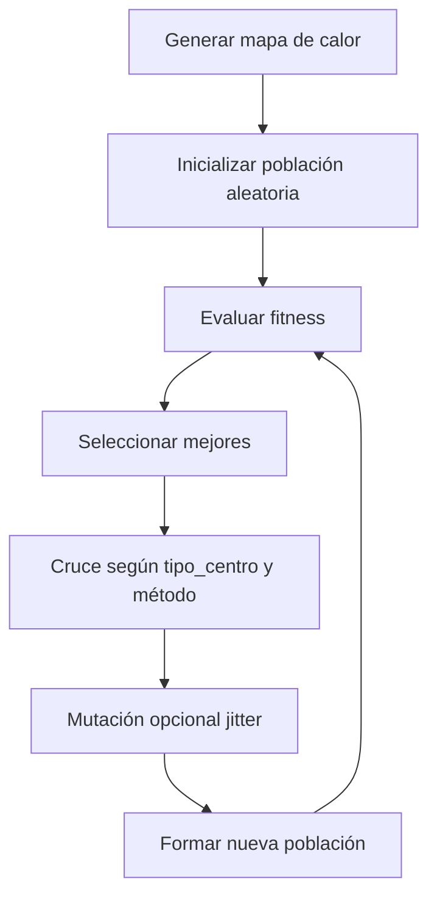

# Explicación de los parámetros utilizados

Este documento describe la configuración y el funcionamiento del algoritmo evolutivo que opera sobre un mapa de calor generado de forma sintética o procedimental.  

Incluye explicaciones de cada parámetro, fórmulas matemáticas y un esquema del flujo general.

---
## Tamaño del espacio de búsqueda
```python
TAMANO = 200
```
Define el **ancho y alto** de la grilla (en celdas) sobre la que se ejecuta el algoritmo. 


---
## Cantidad de individuos
```python
PUNTOS = 90
```
Número de **individuos** (puntos) en la población por generación.


---
## Tipo de centro para el cruce

```python
TIPO_DE_CENTRO = "masa"   # "masa" o "geometrico"
```
Determina cómo se calcula el punto hijo a partir de dos padres:
### Punto medio (geometrico)
$$
x_m = \frac{x_1 + x_2}{2}, \quad y_m = \frac{y_1 + y_2}{2}
$$
- Equidista de ambos padres.
- No considera el valor de fitness.

### Centro de masa ponderado por fitness (masa)
$$
x_m = \frac{x_1 \cdot f_1 + x_2 \cdot f_2}{f_1 + f_2}, \quad
y_m = \frac{y_1 \cdot f_1 + y_2 \cdot f_2}{f_1 + f_2}
$$
- Desplaza el punto hacia el padre con mayor fitness.


---
## Tipo de mapa de calor
```python
MAPA = "perlin"  # "perlin", "random", "blobs", "distancia", etc.
```
Define la **función generadora** del mapa de calor:
- `"perlin"` → Ruido Perlin 2D (patrones suaves y naturales).
- `"random"` → Valores aleatorios uniformes.
-  `"blobs"` → Manchas gaussianas aleatorias.
- `"distancia"` → Inverso de la distancia a un punto central:
$$ h(x, y) = \frac{1}{1 + \sqrt{(x - x_c)^2 + (y - y_c)^2}} $$


---
## Método de emparejamiento
```python
METODO = "cercano"  # "cercano" o "secuencial"
```
Estrategia para elegir la pareja de cruce:
  - `"cercano"` → Se elige el individuo más próximo en distancia euclidiana:
$$ d(p_1, p_2) = \sqrt{(x_1 - x_2)^2 + (y_1 - y_2)^2} $$
  - `"secuencial"` → Se empareja con el siguiente en la lista (circular).


---
## Parámetros de Perlin Noise
```python
ESCALA_PERLIN = 80.0
OCTAVAS_PERLIN = 3
```
- **`ESCALA_PERLIN`**: controla la frecuencia del patrón (valores más altos → variaciones más suaves).
- **`OCTAVAS_PERLIN`**: número de capas de ruido combinadas (más octavas → más detalle).


---
## Número de generaciones
```python
GENERACIONES = 10
```
Cantidad de iteraciones del ciclo evolutivo.


---
## Parámetros de Selección
```python
PORCENTAJE_SELECCION = 100   # <100 → usa porcentaje, 100 → usa tamaño fijo
NUM_SELECCIONADOS = 30       # usado solo si PORCENTAJE_SELECCION == 100
```

**Modo de selección:**
  - Si `PORCENTAJE_SELECCION < 100` → se selecciona un porcentaje fijo de la población en cada generación.
  - Si `PORCENTAJE_SELECCION == 100` → se ignora el porcentaje y se usa un tamaño fijo (`NUM_SELECCIONADOS`).

---

## Parámetros de Penalización por Proximidad

```python
DISTANCIA_MIN = 2      # distancia mínima deseada entre puntos
PENALIZACION_MAX = 0.4 # penalización máxima por proximidad
```

**Objetivo:** desalentar individuos demasiado cercanos para mantener la población dispersa.
## Resumen visual del flujo



---